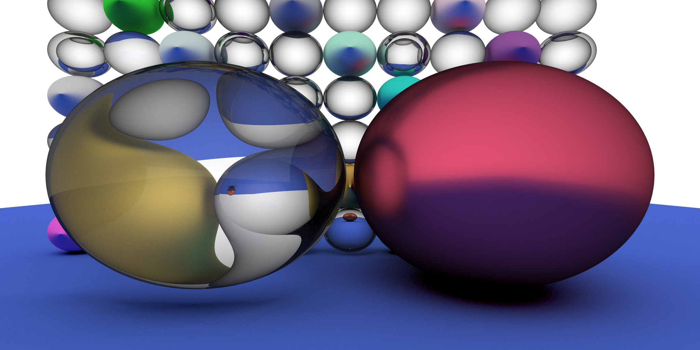
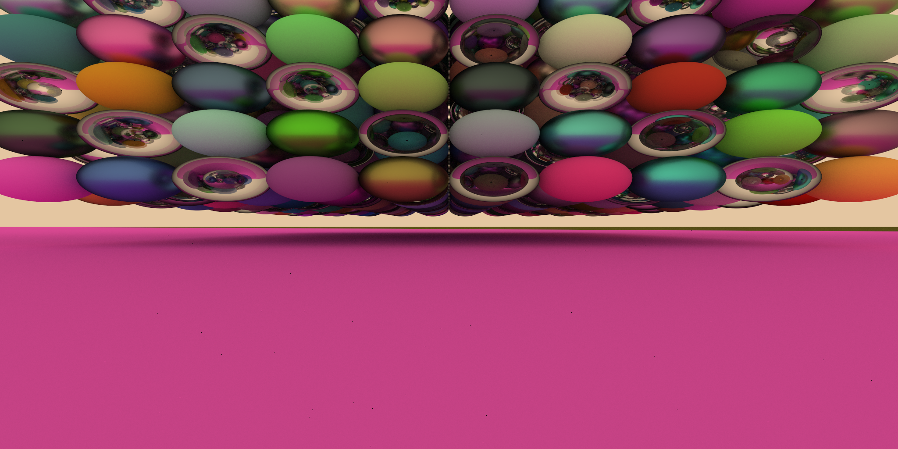

# RayTracing

This is a simple C++ ray tracing learning project.

It's based on Visual Studio 2022.

# Current Performance

# Used Submodules

- [glm](https://github.com/g-truc/glm) for math support (has been removed from GPU side)
- [stb_image](https://github.com/nothings/stb) for picture reading/writing
- [Dear ImGui](https://github.com/ocornut/imgui) not incorporated yet, maybe will be used someday (has been removed from GPU side)
- [YAML cpp](https://github.com/jbeder/yaml-cpp) for scene storage

# Acknowledgement

The knowledge used is basically from:

- [The Cherno](https://www.youtube.com/c/TheChernoProject)
- [Computer Graphics at TU Wien](https://www.youtube.com/channel/UCS9CFdjdEcq_NhaSFb_P-yA)
- [Ray Tracing in one Weekend](https://raytracing.github.io/books/RayTracingInOneWeekend.html#metal/anabstractclassformaterials)
